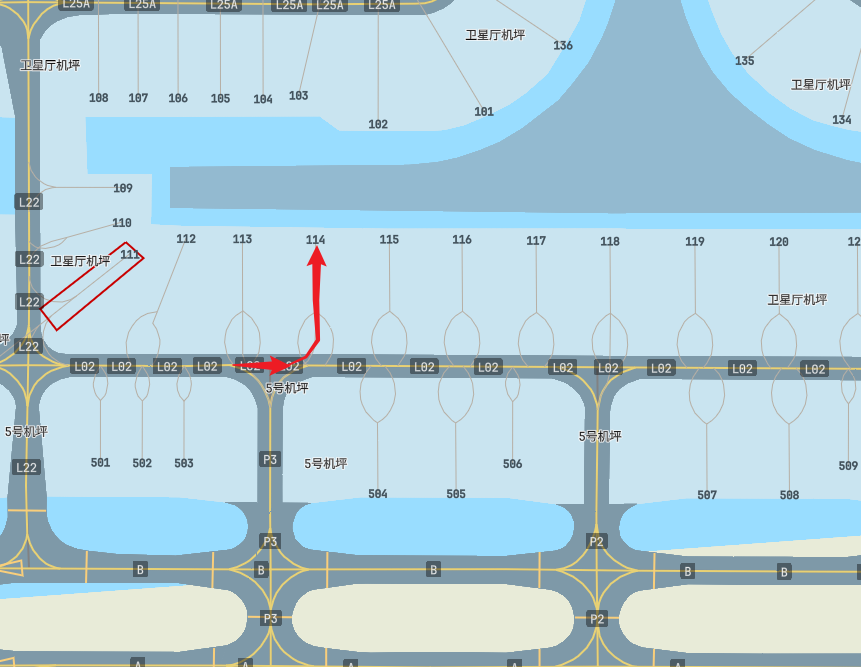
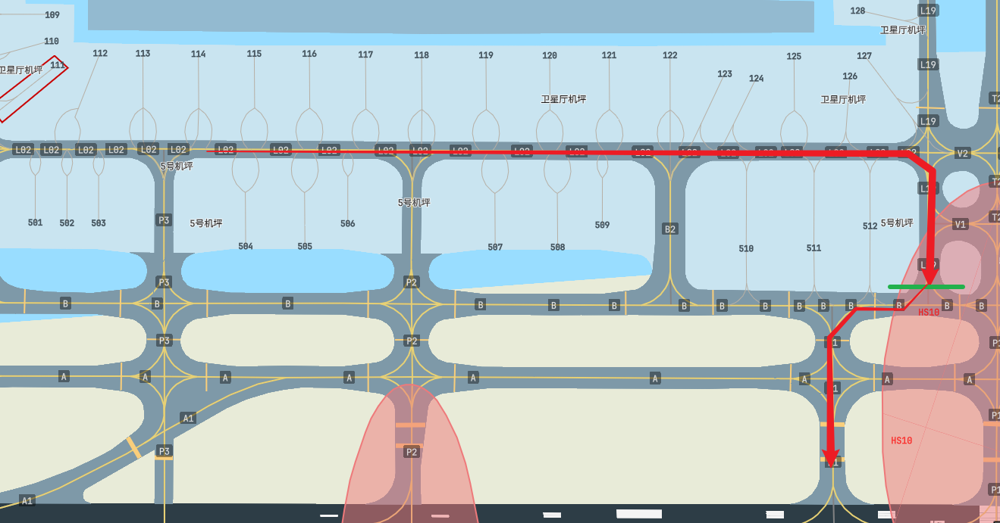

# 空中交通无线电通话用语 

Radiotelephony Communications for Air Traffic Services


## 前言

陆空对话的全称为：空中交通无线电通话用语，本文将以《空中交通无线电通话用语（第四次征求意见版V79）》为参考，带你深入陆空对话的世界。


## 一、前世今身

据美国联邦航空局统计，在1992年的17起管制原因造成的事故征候中，有11起与无线电通话中的理解错误有关。终于，经历了这些事情的人们发现，需要再创建一种语言，可以让各国航空器有一个统一的标准。最后，陆空对话（空中交通无线电通话用语）出现了，实际上陆空对话是一个人造语言。

目前主流有2大派系：FAA、ICAO。FAA的通话保留了一些**自由**的元素，而ICAO的就更加严谨。

世界范围内陆空对话通用的语言为以英语为基础创造的。所有ICAO隶属国，须能够在其国家空域支持英语陆空对话，这也就是我们中国管制需要有2种语言（中文和英文）能力的原因。而作为机组，在中国大陆境内使用自己的母语：中文即可。


## 二、十大性质

一般科技用语的特点：1）科学性；2）单义性；3）简明性；4）习惯性；5）系统性；6）国际性；

一般科技用语不同的特点：7）口语性；8）准确性；9）程序性；10）指令性。


## 三、总则

!!! Note
    
    注：
    
    1. 本手册用语中带*号部分为航空器驾驶员或车辆驾驶员使用的语言。
    2. 本手册用语通话结构中“…”内的内容不可改动。
    3. 本手册用语通话结构中（ ）内的内容可以酌情替换或省略，例如高度层、地点或时间等。
    4. 本手册用语通话结构中的“X”可以代表任何数字。
    5. 本手册中的“高度（level）”如果没有特别注明均为泛指，可代表各种高度。
    6. 本手册中使用“应”的地方是既有规章、标准中载明需要遵守的或强制执行的，不能擅自偏离。


### 基本要求：

1. 发话前，应仔细守听使用频率。
2. 应熟练掌握按键发话（PTT）使用技巧。
3. 使用正常通话语调，通话时每个单词发音应清楚、明白。
4. 发话速度应保持平稳，建议一分钟控制在200（中文）个字/120（英语）个词左右。在发送须**记录的信息**时应降低速率。
5. 发话音量应保持在恒定的水平。
6. 在通话中的数字前应稍作停顿，以便于理解。
7. 应避免使用“啊、哦”等犹豫不决的词。
8. 应熟悉麦克风的操作技巧，特别是在没有恒定水平调节器时应与麦克风保持一定距离。
9. 如果需要把头从麦克风上移开，应暂停通话。
10. 应在开始通话前按下发送开关，待发话完毕后再将其松开，这有助于通话内容的完整性。
11. 发送较长通话内容应不时地做短暂停顿，以便发话人确认使用的频率清晰，并在必要时方便收话人申请重复没有接收到的部分。


### 通话结构：

首次联系时，空中交通管制员采用的通话结构应为：

- 对方完整呼号+己方呼号+通话内容


首次通话以后的各次通话，空中交通管制员可以采用下列通话结构：

- 对方呼号+通话内容


航空器驾驶员采用的通话结构应为：

- *对方呼号+己方完整呼号+通话内容


空中交通管制员确认航空器驾驶员复诵的内容正确时，通话结构应为：

- 对方呼号+“（复诵）正确”
- aircraft call sign + “(READ BACK) CORRECT” 


!!! Note

	注：航空器驾驶员应以完整呼号终止复诵。
	
	例：ATC: CCA1234，雷达看到；PILOT: CCA1234.


### 数字的读法：

| 数字 | 汉字读法 | 英语读法                                     |
| ---- | -------- | -------------------------------------------- |
| 0    | 洞       | ZE-RO                                        |
| 1    | 幺       | WUN                                          |
| 2    | 两       | TOO                                          |
| 3    | 三       | TREE                                         |
| 4    | 四       | FOW-er                                       |
| 5    | 五       | FIFE                                         |
| 6    | 六       | SIX                                          |
| 7    | 拐       | SEV-en                                       |
| 8    | 八       | AIT                                          |
| 9    | 九       | NIN-er                                       |
| ·    | 点       | DAY-SEE-MAL或POINT <br />（point只用于mach） |
| 100  | 百       | HUN-dred                                     |
| 1000 | 千       | TOU-SAND                                     |


### 数字组合读法：

#### 正常情况：

是一位一位读，比如：1（one）、2（two）、3（three）、4（four）、5（five）、6（six）等。


#### 米制高度层的读法：

##### 汉语读法：

1200m，读作：幺两；2400m，读作：两千四；

12500m，读作：幺两五.

这些高度层中文读法无任何规律可言，需要查阅并记忆下表：

| 高度层 | 汉语读法 |
| ------ | -------- |
| 600m   | 六百     |
| 900m   | 九百     |
| 1200m  | 幺两     |
| 1500m  | 幺五     |
| 1800m  | 幺八     |
| 2100m  | 两幺     |
| 2400m  | 两千四   |
| 2700m  | 两拐     |
| 3000m  | 三千     |
| 3300m  | 三千三   |
| 3600m  | 三千六   |
| 3900m  | 三千九   |
| 4200m  | 四两     |
| 4500m  | 四千五   |
| 4800m  | 四千八   |
| 5100m  | 五幺     |
| 5400m  | 五千四   |
| 5700m  | 五拐     |
| 6000m  | 六千     |
| 6300m  | 六千三   |
| 6600m  | 六千六   |
| 6900m  | 六千九   |
| 7200m  | 拐两     |
| 7500m  | 拐五     |
| 7800m  | 拐八     |
| 8100m  | 八幺     |
| 8400m  | 八千四   |
| 8900m  | 八千九   |
| 9200m  | 九千二   |
| 9500m  | 九千五   |
| 9800m  | 九千八   |
| 10100m | 幺洞幺   |
| 10400m | 幺洞四   |
| 10700m | 幺洞拐   |
| 11000m | 幺幺洞   |
| 11300m | 幺幺三   |
| 11600m | 幺幺六   |
| 11900m | 幺幺九   |
| 12200m | 幺两两   |
| 12500m | 幺两五   |


##### 英语读法：

反观英语读法就简单多了，直接读出即可。

1200m，读作：one thousand two hundred meters；2400m，读作：two thousand four hundred meters；

12500m，读作：one two thousand five hundred meters.


#### 英制高度层的读法：

类推于米制高度层，中文读法：“X” + 英尺、高度层 + X。

3000ft，读作：3000英尺；12000ft(FL120)，读作：高度层120。


#### 时间的读法：

如果无特殊说明的情况下，默认使用国际协调时UTC。

09:00，读作：洞九洞洞、整点

现在是09:00，可将09:15，读作：这个点的幺五分；将10:15，读作：下个点的幺五分。


#### 速度的读法：

汉语读法：“马赫数点” + XX、“马赫数” + X + “点” + XX、XX + “米秒”。

英语读法：“MACH NUMBER POINT” + XX、“MACH NUMBER” + X + “POINT” + XX。


### 字母的读法：

| 字母 | 单词     |
| ---- | -------- |
| A    | Alpha    |
| B    | Bravo    |
| C    | Charlie  |
| D    | Delta    |
| E    | Echo     |
| F    | Foxtrot  |
| G    | Golf     |
| H    | Hotel    |
| I    | India    |
| J    | Juliett  |
| K    | Kilo     |
| L    | Lima     |
| M    | Mike     |
| N    | November |
| O    | Oscar    |
| P    | Papa     |
| Q    | Quebec   |
| R    | Romeo    |
| S    | Sierra   |
| T    | Tango    |
| U    | Uniform  |
| V    | Victor   |
| W    | Whiskey  |
| X    | X-ray    |
| Y    | Yankee   |
| Z    | Zulu     |


#### VOR和NDB的读法：

汉语读法：LKO，读作：龙口（该台的中文名，eAIP的附录中包含）。

英语读法：LKO，读作：LIMA KILO OSCAR（逐一读出字母）

!!! Note


	注：在进离程序中，VOR和NDB也使用如上读法，例如：VYK-01A（大王庄洞幺ALPHA、VYK-ZE-RO WUN ALPHA）


#### 航点的读法：

汉语&英语读法：ANDIN，读作：ANDIN（自然拼读法）。

汉语&英语读法：P23，读作：PEE 23（TOO TREE）。

汉语&英语读法：JN213，读作：JULIETT NOVEMBER 两幺三（TOO WUN TREE）。


#### 标准的单词和词组：

| 单词                         | 汉语                              |
| ---------------------------- | --------------------------------- |
| ACKNOWLEDGE                  | 请认收                            |
| AFFIRM                       | 是的                              |
| APPROVED                     | 同意                              |
| BREAK                        | 还有（不明显信息区别之间的分割）  |
| BREAK BREAK                  | BREAK BREAK（连续指令之间的分割） |
| CANCEL                       | 取消                              |
| CHECK                        | 检查                              |
| CLEARED                      | 可以                              |
| CONFIRM                      | 证实                              |
| CONTACT                      | 联系                              |
| CORRECT                      | 正确                              |
| CORRECTION                   | 更正                              |
| DISREGARD                    | 作废                              |
| GO AHEAD                     | 请讲                              |
| HOW DO YOU READ?             | 你听我几个？                      |
| I SAY AGAIN                  | 我重复一遍                        |
| MAINTAIN                     | 保持                              |
| MONITOR                      | 守听                              |
| NEGATIVE                     | 错误、不同意或没有                |
| OUT                          | 完毕                              |
| OVER                         | 请回答                            |
| READ BACK                    | 复诵                              |
| RECLEARED                    | 重新许可                          |
| REPORT                       | 报告                              |
| REQUEST                      | 申请                              |
| ROGER                        | 收到                              |
| SAY AGAIN                    | 重复一遍                          |
| SPEAK SLOWER                 | 讲慢点                            |
| STANDBY(STBY)                | 稍等                              |
| VERIFY                       | 核实                              |
| UNABLE<br />UNABLE TO COMPLY | 无法执行                          |
| WILCO                        | 照办                              |
| WORDS TWICE                  | 讲两遍                            |


### 字母和数字组合的读法：

#### 航空器型号的读法：

这里将不再使用正常情况下无线电的数字读法，而是使用直接读出的方式。

A320，读作：A-320；

B738，读作：B738 或 B737 - 800。

!!! Note
	
	注：“-”在航空领域通常读作“减”，而并非“杠”。


#### 航空器呼号的读法：

本质上航空领域的无线电和业余无线电的部分内容 **高度相似**，呼号这部分也基本类似，但需要注意一些简略和缩写方式。

##### 标准读法：

###### 大部分通航呼号读法：

航空器驾驶员驾驶着塞斯纳飞机制造商，注册号为：G-ABCD时，有以下两种方式：

!!! Note
	
	注：飞机制造商的名称可读可不读，下同。

- 第一种：

  按部就班的每个字母读

  - 汉语&英语读法读法：G-ABCD，读作：GOLF ALPHA BRAVO CHARLIE DELTA
  - 汉语&英语读法读法：C G-ABCD，读作：塞斯纳（Cessna）GOLF ALPHA BRAVO CHARLIE DELTA

- 第二种：

  在建立满意的双向稳定通讯后，可适当缩减：

  - 航空器注册号的第一个字母加至少最后2个字母：C G-CD，读作：[塞斯纳（Cessna）] GOLF CHARLIE DELTA

!!! Note
	
	注：只有管制单位缩减了呼号后，航空器才可使用缩减后的呼号。


###### 大商业航班呼号读法：

这里指的商业航班分类标准是以拥有航空器经营人的无线电呼号作为分类标准

航空器驾驶员经营的无线电呼号为：CCA，飞行航班号为：1234，飞机注册号为：B-ABCD

- 第一种：

  - 航空器驾驶员经营的无线电呼号+飞机后四位注册号：CCA ABCD，读作：国际/国航（Air China）ALPHA BRAVO CHARLIE DELTA
  - 航空器驾驶员经营的无线电呼号+飞机航班号：CCA 1234，读作：国际/国航（Air China）ONE TWO THREE FOUR

- 第二种：

  上同，在建立满意的双向稳定通讯后，可适当缩减：

  - 航空器经营人的无线电呼号+航空器的注册号中和至少最后两个字母：CCA CD，读作：国际/国航（Air China）CHARLIE DELTA

!!! Note
	
	注：采用飞机航班号的读法无省略。

###### 重型飞机和超大型飞机呼号读法：

参考通航和商业航班读法，根据其尾流等级分为：H、S两类

重型飞机需在**首次呼叫管制单位时**，呼号后加入：重型（HEAVY）；超大型飞机（A380）需在**首次呼叫管制单位时**，呼号后加入：SUPER（SUPER）


#### 管制单位呼号的读法：

| 管制单位或服务                                        | 汉语简称 | 后缀英语简称 |
| ----------------------------------------------------- | -------- | ------------ |
| 区域管制中心 （Area control center）                  | 区域     | CONTROL      |
| 进近管制 （Approach control）                         | 进近     | APPROACH     |
| 离场雷达管制 （Approach control radar departure）     | 离场     | DEPARTURE    |
| 机场管制 （Aerodrome control）                        | 塔台     | TOWER        |
| 地面活动管制 （Surface movement control）             | 地面     | GROUND       |
| 放行许可发布 （Clearance delivery）                   | 放行     | DELIVERY     |
| 机坪管制/管理服务（Apron control/management service） | 机坪     | APRON        |
| 飞行服务/航空情报服务（Flight information service）   | 飞服     | INFORMATION  |
| 航空电台 （Aeronautical station）                     | 电台     | RADIO        |
| 五边监控席 （Final approach radar monitoring）        | 五边     | FINAL        |


### 常用句式：

##### 证实哪位叫：

“哪个呼叫”+管制单位，“重复一遍你的呼号”

 “STATION CALLING” + (ATC unit), “SAY AGAIN YOUR CALL SIGN”

##### 保持联系：

- 我将与你保持联系。

  I will keep you advised.

- 与我（我们）保持联系。

  Keep me (us) advised.

##### 无线电测试：

- 你听我几个？
  HOW DO YOU READ?
- “听你”+数字+“个”
  “I READ YOU (or READABILITY)” + number

| 信号质量                                         | 汉语读法 | 英语读法 |
| ------------------------------------------------ | -------- | -------- |
| 不清楚（1） Unreadable                           | 一个     | WUN      |
| 可断续听到（2） Readable now and then            | 两个     | TOO      |
| 能听清但很困难（3） Readable but with difficulty | 三个     | TREE     |
| 清楚（4） Readable                               | 四个     | FOW-er   |
| 非常清晰（5） Perfectly readable                 | 五个     | FIFE     |

!!! Note
	

	注：此表应是每一位飞行员、管制员需记忆的内容

##### 移交及转换频率：

- 航空器呼号+“联系”+管制单位呼号+频率

  aircraft call sign + “CONTACT” + ATC call sign + (“ON”) + frequency

- “在”+时间+“联系”+单位呼号+频率；

  “AT” + time + “CONTACT” + ATC call sign + (“ON”) + frequency

- “过”+地点+“联系”+单位呼号+频率；

  “OVER” + location + “CONTACT” + ATC call sign + (“ON”) + frequency

- “如果联系不上”+管制指令

  “IF NOT CONTACT” + ATC instructions

- 航空器呼号+“转频到”+单位呼号+频率数值+“守听”

  aircraft call sign + “STAND BY FOR” + ATC call sign + (“ON”) + frequency

- 管制单位呼号+航空器呼号+“申请转换频率”+频率数值

  ATC call sign + aircraft call sign + “REQUEST CHANGE TO” + frequency

- 航空器呼号+（管制单位呼号）+“同意转换频率”

  aircraft call sign + (ATC call sign) + “FREQUENCY CHANGE APPROVED”

- 航空器呼号+（管制单位呼号）+“当前频率保持长守

  aircraft call sign + (ATC call sign) + “REMAIN THIS FREQUENCY”

- 航空器呼号+管制单位呼号+“守听”+（管制单位呼号）+频率数值

  aircraft call sign + ATC call sign+ “MONITOR” + (ATC call sign) + frequency


### 基本通话用语：

以下文本中的所有内容，将会以示例的形式，而非单出拆分。

在以下内容中，一句话同样含义的话通常有多种表达句式。在此，我们受限于篇幅限制，我们没有办法一一列举出来。如果在本章节以外的用语，需判断正确时，请翻阅以下链接中的文件：

1. [CAAC.空中交通无线电通话用语（第四次征求意见版V79）](./References/空中交通无线电通话用语（第四次征求意见版V79）.pdf)；

2. [CAAC.MH/T 4014-2003.空中交通无线电通话用语](https://www.caac.gov.cn/XXGK/XXGK/BZGF/HYBZ/201511/P020170804579259214829.pdf)；

这里以ZSPD（上海浦东）-ZBAA（北京首都）的东方航空（CES）5101航班为例，巡航高度：34100ft，航路：

```
(ZSPD-ZBAA-01)  POMOK G330 PIMOL A593 DALIM W157 AVBOX
```

!!! Note

    注：如果您不知道如何查询航路，可以[点此](./Airlines_flight_route.md)查阅教程。

#### 放行

频道选择：DEL、RMP(A_GND)、GND、TWR、APP、CTR（低位席位优先）

!!! Notse

    注：机坪席位（即RMP/A_GND，例如ZSPD_RMP/ZSPD_A_GND）不提供放行服务；

---

##### 放行

P: 浦东放行，上午好，东方5155，停机位114，通波Alpha抄收，申请放行至北京首都。

> Pudong Delivery, good morning, China Eastern 5155, Gate/Stand 114, with information Alpha, request IFR clearance to Beijing Capital.

A: 东方5155，放行(排)第一个，稍等

> CES5155, Your are number one, please STBY(STAND BY).

A: 东方5155，浦东放行，可以沿飞行计划航路放行到北京首都，[通波A有效]，沿PIKAS-95D（PIK95D）（标准程序）离场，使用跑道35R，[巡航高度层10400m(FL341)]，起始高度900米，[(终端区)修正海压1013（ATIS存在后，可不念）]，应答机5033，离地后联系进近126.650。

> CES5155, Pudong Delivery, cleared to Beijing Capital via flight planned route, [information Alpha is available], (follow) PIKAS-95D departure, runway in use 35R, [cruising level 10,400m], initial climb to 900m [on (terminal) QNH1013], squawk 5033, departure frequency 126.650.

P: 可以沿飞行计划航路放行到北京首都，沿PIKAS-95D（PIK95D）（标准程序）离场，使用跑道35R，[巡航高度层10400m(FL341)]，起始高度900米，[(终端区)修正海压1013（ATIS存在后，可不念）]，应答机5033，离地后联系进近126.650，东方5155。

> Cleared to Beijing Capital via flight planned route, (follow) PIKAS-95D departure, runway in use 35R, [cruising level 10,400m], initial climb to 900m [on (terminal) QNH1013], squawk 5033, departure frequency 126.650, CES5155.

---

###### 复述正确

A: 东方5155，复述正确，准备好报。

> CES5155, readback correct, call/report when ready [for push(back) and start(up)].

---

###### 复述错误

A: 东方5155，不正确，应答机5033（假设应答机复述错误）。

> CES5155, negative, squawk 5033.

P: 应答机5033，东方5155。

> Squawk 5033, CES5155.

---

##### 推出、开车

!!! Warning

	由于这部分内容，在伟大的@[Yiheng Gui(5516)](https://github.com/supermastergui)；制作时，未发现《上海浦东国际机场（ZSPD）标准运行程序》文件，导致滑行路线和SOP，**略有出入**，请勿在连线飞行中使用。

P: 浦东放行，东方5155，准备好推出开车。

> Hongqiao Delivery, CES5155, Ready for pushback and startup.

A: 东方5155，联系浦东地面121.700。

> CES5155, Contact Pudong Ground on 121.700.

P: 联系浦东地面121.700，再见，东方5155。

> Contact Pudong Ground on 121.700, goodbay, CES5155.

P: 浦东地面，上午好，东方5155，停机位114，申请推出开车。

> Pudong Ground, good morning, CES5155, Gate 114, request pushback and startup.

---

###### 正常情况

A: 东方5155，同意推出开车，跑道35R，（头朝向南）。

> CES5155, Pushback and startup approved, runway 35R, (face south).

P: 可以退出开车，跑道35R，（头朝向南），东方5155

> Pushback and startup approved, runway 35R, (face south), CES5155.


!!! Note "推出开车示意图"
	
	
	红色为飞机头朝向。

---

###### 有交通情况

A: 东方5155，稍等推出，地面有交通，（挂好拖车报）。

> CES5155, Stand by for pushback , ground traffic.

P: 稍等推出，（挂好拖车报），东方5155。

> Stand by for pushback, CES5155.

---

##### 滑行

P: 浦东地面，东方5155，L02，申请滑行。

> Pudong Ground, CES5155, at L02, request taxi.

A: 东方5155，沿L02，L19。在B外等待。

> CES5155, Taxi via L02, L19. Hold short at B.

P: 沿L02，L19。在B外等待, 东方5155。

> Taxi via L02, L19. Hold short at B, CES5155

---

###### 短跑道起飞

A: 东方5515，能否接受从B1，非全跑道离场，跑道35R，(可用起飞距离3780米)，是否接受？

> CES5155, Advise able to depart from runway 35R, intersection B1, (take-off distance available 3780m).

P: 接受，东方5515。

> Accept, CES5155.

---

A: 东方5155，继续滑行沿B，B1，跑道35R外等。

> CES5155, Continue taxi via B, B1, hold short at runway 35R.

P: 继续滑行沿B，B1，跑道35R外等，东方5155。

> Continue taxi via B, B1, hold short at runway 35R, CES5155.

A: 东方5155，联系浦东塔台118.800。

> CES5155, Contact Pudong Tower 118.800.

P: 塔台118.800，东方5155。

> Contact Pudong Tower 118.800, CES5155.

!!! Note "滑行路线示意图"

	

---

##### 起飞

A: 东方5155，(目视前机A321离地后)，进跑道35R等待。

> CES5155, (behind A321 airborn)，Line up (behind) and wait, runway 35R.

P: 进跑道35R等待，(目视前机A321离地后)，东方5155。

> Line up (behind) and wait, (behind A321 airborn), runway 35R, CES5155.

---

METAR ZSPD 301200Z 19002MPS CAVOK 13/05 Q1017 NOSIG

A: 东方5155，地面风190，2米/秒，（修正海压1017），跑道35R，可以起飞

> CES5155, Surface wind 190 degress, 2 meters per second, runway 35R, cleared for take-off.

P: 跑道35R，可以起飞，东方5155.

> Runway 35R, cleared for take-off, CES5155.

P: 跑道35R，离地了，东方5155.

> Runway 35R, airborne, CES5155.

A: 东方5155，联系上海进近120.300。

> CES5155, Contact Shanghai Approach 120.300.

P: 东方

---

## 未完待续

---


## 参考资料

[1] [CAAC.空中交通无线电通话用语（第四次征求意见版V79）](./References/空中交通无线电通话用语（第四次征求意见版V79）.pdf)

[2] [CAAC.MH/T 4014-2003.空中交通无线电通话用语](https://www.caac.gov.cn/XXGK/XXGK/BZGF/HYBZ/201511/P020170804579259214829.pdf)
